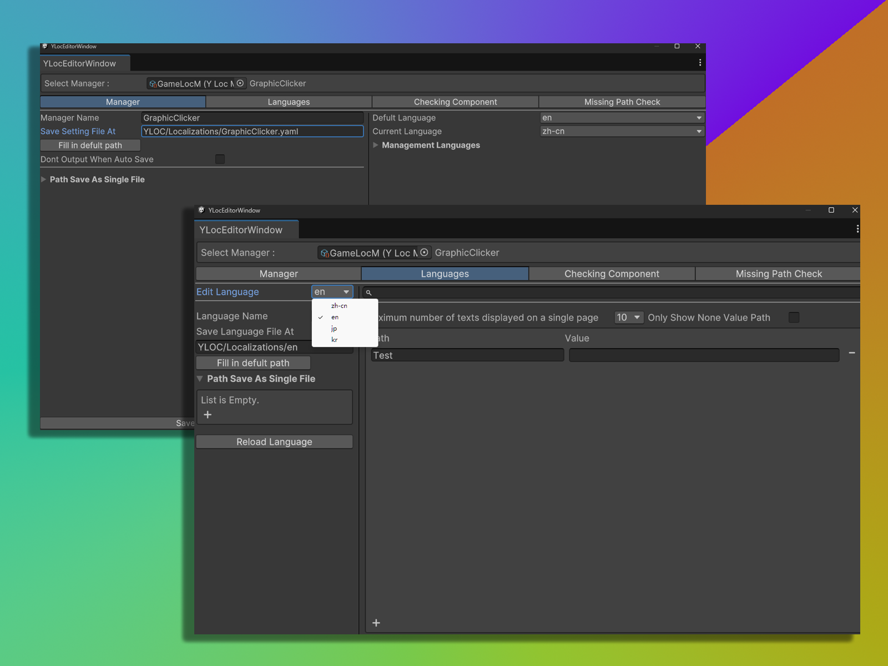

# 简介

***

YLOC 是 YAML Localization Operating Central 的简称。这个名称除了前两个词都没什么意义，纯粹是为了凑类似YAML的循环名称。

***

## YLOC 是一个基于 YAML 的 Unity 插件-本地化文件管理系统，旨在简化 Unity 本地化的工作流程

拓展包括一个统一的中心窗口，可以创建、编辑和管理本地化的可序列化物体，这些物体保存了不同语言的本地化信息，可以作为语言设置在运行时使用。

***

拓展还包括一个 Unity 编辑器脚本，可以选择其它挂载在物体上的脚本中的字符串属性，修改它们的本地化信息。

***

在运行时，只需要修改保存的语言设置，就可以自动切换语言（包括脚本中的字符串）。

***

除了在构建前打包所有本地化信息，还可以在运行时读取 YAML 文件向现有语言添加新的键值对，或直接加载新的语言。

***

YAML 文件天然易于编写键值对，但对嵌套结构不适应。因此， YLOC 支持将多个文件链接为一个语言包。

语言包在 Unity 中以 SerializableObject 形式保存，多个语言包合并为一个 SerializableObject 作为语言设置。

***

在 Unity 编辑器中，你还可以检查当前场景中挂载了 YLOC 本地化脚本的物体，并查看或修改这些物体的本地化信息。

您还可以一键检查所有 YLOC 本地化语言的键值对是否完整，以及语言包之间的键值对是否一致。

